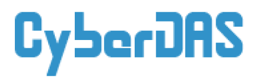

<br />
<p align="center">
  <a href="https://github.com/CyberDAS-Dev/API">
    
  </a>

  <h3 align="center">CyberDAS API</h3>
  <p align="center">
    Программный интерфейс CyberDAS'a, проекта цифровизации общежития
    <br />
    <a href="https://github.com/CyberDAS-Dev/API"><strong>Документация »</strong></a>
    <br />
    <br />
    <a href="https://github.com/CyberDAS-Dev/API/issues">Сообщить об ошибке</a>
    ·
    <a href="https://github.com/CyberDAS-Dev/API/issues">Предложить улучшение</a>
  </p>
</p>

<br>
<details open="open">
  <summary>Содержание</summary>
  <ol>
    <li><a href="#о-проекте">О проекте</a></li>
    <li>
      <a href="#приступаем-к-работе">Приступаем к работе</a>
      <ul>
        <li><a href="#необходимое-по">Необходимое ПО</a></li>
        <li><a href="#установка">Установка</a></li>
      </ul>
    </li>
    <li><a href="#дорожная-карта">Дорожная карта</a></li>
    <li><a href="#содействие">Содействие</a></li>
    <li><a href="#лицензия">Лицензия</a></li>
    <li><a href="#контакты">Контакты</a></li>
    <li><a href="#благодарности">Благодарности</a></li>
  </ol>
</details>
<br>

<div align="center">
  <a href="https://www.python.org/">
    
  </a>
  <a href="https://falcon.readthedocs.io">
    
  </a>
  <a href="https://www.postgresql.org">
    
  </a>
</div>

<br>
<hr>
<br>

## О проекте

Вы когда-нибудь стояли в очереди на заселение по несколько часов? Жили пару дней без света в коридоре, потому что не хотелось подниматься к коменданту? Тогда вам знакомо, как неприветлива бывает бюрократия.

Этот проект призван упростить жизнь студентов в общежитии, избавив от их бюрократических рутин и дав им новые, цифровые, возможности.

Мы хотим дать студентам возможность:
* Оставлять заявки на вызов технических служб не выходя из комнаты
* Дистанционно записываться на заселение и не тратить свою жизнь в очереди 
* Составлять и отправлять заявления в администрацию без особых усилий
* Делиться ненужными вещами без пабликов-барахолок в ВК
* И многое другое... 

Сейчас этот проект создается на базе [общежития ДАС МГУ](https://das.msk.ru), но мы планируем сделать API достаточно абстрактным для того, чтобы его можно было развертывать и использовать и в других общежитиях без каких либо манипуляций.

Если ты тоже хочешь помочь и умеешь в дизайн или код, то пиши <a href="#контакты">нам</a>!

## Приступаем к работе

Следуйте этим шагам, для того чтобы локально развернуть версию API и поэкспериментировать с ней.

### Необходимое ПО

Команды будут отличаться в зависимости от вашего пакетного менеджера. Инструкции написаны для APT (его используют Debian, Ubuntu).

* PostgreSQL и pgAdmin4 (опционально) 
  ```bash
  apt-get install postgresql-12
  apt-get install pgadmin4
  ```
* Python 3 и pip
  ```bash
  apt-get install python3
  apt-get install python3-pip
  ```
* setuptools
  ```bash
  pip3 install --upgrade setuptools wheel
  ```

### Установка

1. Скопируйте репозиторий
   ```bash
   git clone https://github.com/CyberDAS-Dev/API.git
   ```
2. Запустите pgAdmin и создайте новый сервер
3. Создайте новую базу данных 
4. Укажите URL вашей базы данных в поле `sqlalchemy.url` в секции `alembic` файла `cfg.ini`, в таком формате:
    ```bash
    postgresql+psycopg2://[Postgres login]:[Postgres password]@[Postgres server url]/[DB name]
    ```
5. Все последующие действия нужно производить, находясь в одной папке с файлом `README.md`
    ```bash
    cd API
    ```
6. Создайте виртуальное окружение Питона и активируйте его
    ```bash
    python3 -m venv .venv
    source .venv/bin/activate
    ```
7. Установите проект со всеми зависимостями
    ```bash
    pip3 install -e ".[testing]"
    ```
8. Обновите базу данных до последней ревизии и инициализируйте её
    ```bash
    alembic -c cfg.ini upgrade head
    initialize_db
    ```
9. Убедитесь в том, что все тесты проходят без предупреждений
    ```bashx
    pytest -W error
    ```
10. Запустите Gunicorn-сервер; API будет доступно по адресу http://127.0.0.1:8000
    ```bash
    gunicorn cyberdas.app
    ```

## Дорожная карта

Смотрите [open issues](https://github.com/CyberDAS-Dev/API/issues) для информации о планируемых улучшениях и известных проблемах.


## Содействие

Совместная разработка это то, что делает опен-сорс сообщество таким удивительным местом для обучения и творчества. Мы **ценим** любой ваш вклад в проект.

1. Сделайте копию (Fork) проекта
2. Создайте свою ветку для работы (`git checkout -b feature/AmazingFeature`)
3. Сохраните изменения (`git commit -m 'Add some AmazingFeature'`)
4. Отправьте их в удаленную ветку (`git push origin feature/AmazingFeature`)
5. Создайте Pull Request


## Лицензия

Распространяется под лицензией MIT. Смотрите `LICENSE` для дополнительной информации.


## Контакты

Иван Акостелов - ivanakostelov@gmail.com

Ссылка на проект: [https://github.com/CyberDAS-Dev/API](https://github.com/CyberDAS-Dev/API)


## Благодарности
* [Александр Букреев](https://github.com/TarLung), оригинальный создатель проекта
* [Студенческий комитет ДАС МГУ](https://vk.com/studcomdas)
* [Best-README-Template](https://github.com/othneildrew/Best-README-Template)
